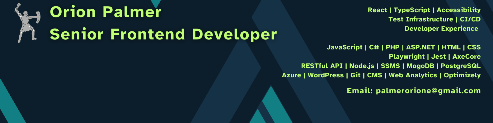

# Hey there! I'm Orion

Senior Frontend Developer specializing in Accessibility, Testing Infrastructure, and Developer Experience.

Creator of **Self-Coded**, a platform dedicated to helping developers build accessible, maintainable, and scalable applications.

I believe great software should be:

- Accessible
- Reliable
- Understandable
- Built to last

 ## About Me

I transitioned from Music Education into Software Engineering and now work as a Senior Frontend Developer focused on accessibility systems, automated testing, and frontend architecture.

My work centers around helping teams:

- Improve WCAG compliance
- Scale testing infrastructure
- Build better developer experiences
- Deliver quality through automation

Outside of work, I create educational content through Self-Coded where I teach frontend development, accessibility, and engineering best practices.

## Current Focus

🔭 Building Self-Coded

♿ Advancing accessibility automation and WCAG compliance

🧪 Expanding Playwright and CI/CD testing strategies

📚 Teaching frontend development through content creation

🎵 Composing music and creative projects

## Exploring

♿ Accessibility automation

🤖 AI-assisted engineering workflows

🏗️ Frontend architecture

📖 Developer education

## Accessibility First

Accessibility is a core part of my engineering philosophy.

Areas of focus:

- WCAG 2.2 AA
- AxeCore Integration
- Playwright Accessibility Testing
- Screen Reader Testing
- Semantic HTML
- ARIA Authoring Practices
- CI/CD Accessibility Enforcement
- Developer Accessibility Education

## Tech Stack

### Frontend

React • TypeScript • JavaScript • HTML • CSS • Sass

### Testing & Quality

Playwright • Jest • AxeCore • WCAG 2.2

### Platforms & Tooling

Azure DevOps • GitHub • Docker • CI/CD

### Backend Experience

C# • ASP.NET • PHP • Node.js

## Self-Coded

Self-Coded is my educational platform focused on helping developers become more confident engineers through practical learning and real-world development experience.

Topics include:

- Frontend Development
- Accessibility
- React & TypeScript
- Testing Strategies
- Career Development
- Developer Mindset

Coming soon on YouTube.
 
## Connect

📧 Email: [palmerorione@gmail.com](mailto:palmerorione@gmail.com)

💼 LinkedIn: [Orion Palmer](https://www.linkedin.com/in/orion-palmer)

📺 YouTube: [Self-Coded](https://www.youtube.com/channel/UC1PLqeZnOUcLVteRSYwk1WQ)

📝 Blog: [orionpalmer.hashnode.dev](https://orionpalmer.hashnode.dev/)
